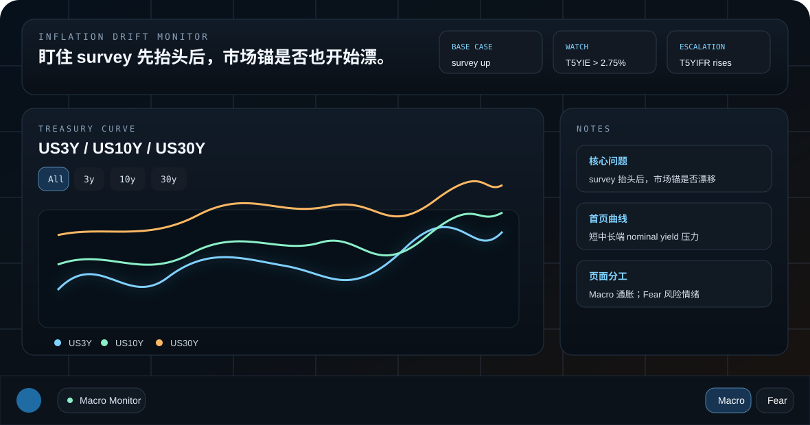
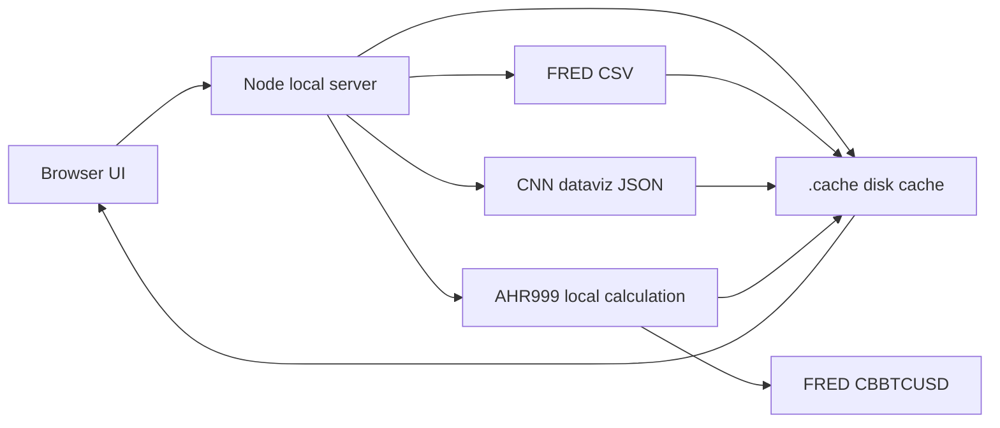

# Inflation Drift Monitor

一个运行在浏览器里的 Windows 托盘风格宏观监控看板，用来追踪：

> survey-based 通胀预期先抬头之后，市场端 breakeven、forward inflation compensation 和利率曲线是否也开始上漂。



## 功能概览

- **首页 Treasury Curve**：同时展示 `US3Y / US10Y / US30Y`，支持 `All / 3y / 10y / 30y` 单独切换。
- **归一化对比**：在 `All` 模式下可切换 `利率绝对值 / 归一化`，归一化以当前时间窗口起点为 `100`。
- **Macro 页**：监控 breakeven、long anchor、survey、nominal/real yield components 和触发项。
- **Fear 页**：监控 CNN Fear & Greed、AHR999，以及 CNN 的 7 个拆分指标。
- **本地缓存优先**：打开页面先读 `.cache`，再做增量更新；远端失败时尽量展示 stale cache，而不是直接清空。
- **状态提示**：页面顶部显示加载中、完成数量、错误/重试/缓存状态。

## 当前数据源

| 模块 | 指标 | 来源 | 说明 |
| --- | --- | --- | --- |
| Treasury Curve | `DGS3` / `DGS10` / `DGS30` | FRED | 首页三线图 |
| Breakevens | `T5YIE` / `T10YIE` / `T5YIFR` | FRED | 市场 inflation compensation |
| Components | `DGS5` / `DFII5` / `DGS10` | FRED | 拆解 nominal yield 与 real yield |
| Surveys | `MICH` | FRED | Michigan 1Y survey inflation expectations |
| CPI Momentum | `CORESTICKM679SFRBATL` | FRED | Atlanta Fed sticky core CPI 3M annualized |
| Fear | CNN Fear & Greed graphdata | CNN dataviz endpoint | Headline + 7 个拆分指标 |
| AHR999 | 本地派生 | FRED `CBBTCUSD` | 用 BTC 历史价格本地计算 |

> 注意：CNN endpoint 是公开 dataviz 数据端点，不是正式商业 API，偶尔可能被网络、地区或反爬策略影响。页面会显示具体状态。

## 快速启动

### Windows

1. 安装 [Node.js](https://nodejs.org/)。
2. 双击 `start.bat`。
3. 浏览器打开 `http://127.0.0.1:8787/`。

如果 CNN 数据经常失败，可安装 Python 依赖：

```powershell
python -m pip install -r requirements.txt
```

### macOS

你的朋友使用最新 macOS 可以运行，但需要先准备 Node.js；Python 依赖是推荐项，用于提高 CNN 数据抓取成功率。

1. 安装 Node.js，推荐用 Homebrew：

```bash
brew install node
```

2. 克隆项目并进入目录：

```bash
git clone https://github.com/GaryGrimes/Macro.git
cd Macro
```

3. 推荐安装 Python 依赖：

```bash
python3 -m venv .venv
source .venv/bin/activate
python3 -m pip install -r requirements.txt
```

4. 启动：

```bash
sh start.sh
```

5. 如果浏览器没有自动打开，手动访问：

```text
http://127.0.0.1:8787/
```

## macOS 兼容性检查

当前版本已经避免了 Windows-only 的 `curl.exe` 硬编码：

- Windows 会使用 `curl.exe`。
- macOS / Linux 会使用 `curl`。
- Windows 默认调用 `python`。
- macOS / Linux 默认调用 `python3`。
- 也可以用环境变量覆盖：`PYTHON=/path/to/python CURL=/path/to/curl node server.js`。

最新 macOS 通常自带 `curl`，但不一定自带合适的 Node.js 或 Python 包，所以 README 的 macOS 步骤里把 Node 和 Python 依赖单独列出来。

## 使用方式

1. 首页先看 `US3Y / US10Y / US30Y`：
   - `All`：三条曲线合看，判断短中长端 nominal yield 是否同步上行。
   - `3y / 10y / 30y`：单独看某一期限。
   - `归一化`：把窗口起点设为 100，看相对变化谁更陡。

2. 点击右下角 `Macro`：
   - 看 `T5YIE`、`T10YIE`、`T5YIFR` 是否继续上漂。
   - 用 `DGS5` 和 `DFII5` 判断 breakeven 是 nominal leg 变了，还是 real yield leg 变了。
   - 用 survey 和 CPI momentum 做交叉验证。

3. 点击右下角 `Fear`：
   - 看 CNN Fear & Greed 的 headline 状态。
   - 看 market momentum、VIX、put/call、junk bond、safe haven 等拆分项。
   - 看 AHR999 作为 BTC valuation heat proxy。

4. 图表 hover：
   - tooltip 会自动避让左右边界。
   - 首页三线图在归一化模式下同时显示 index value 与真实利率。

## 数据缓存机制



加载顺序：

1. 页面启动后先读取 `.cache`。
2. UI 立即显示已有本地数据。
3. 后台对 FRED / CNN / AHR999 做增量更新。
4. 更新成功后写回 `.cache`。
5. 如果远端失败但本地有旧数据，状态栏会显示 stale cache。

## 常见问题

### 页面打开但没有数据

先看顶部状态栏。如果显示 stale cache，说明远端没连上但本地缓存可用。如果显示 error，通常是网络、DNS、代理或 CNN endpoint 被阻断。

### CNN Fear & Greed 拉不到

先安装 Python 依赖：

```bash
python3 -m pip install -r requirements.txt
```

然后重新运行：

```bash
sh start.sh
```

### AHR999 只有很短历史

AHR999 是本地从 FRED `CBBTCUSD` 历史价格计算出来的。首次运行需要成功拉到 BTC 历史数据；之后会使用 `.cache/ahr_state.json` 增量计算。

### 端口被占用

可以换端口：

```bash
PORT=8790 sh start.sh
```

然后打开：

```text
http://127.0.0.1:8790/
```

## 开发说明

主要文件：

- `index.html`：页面结构。
- `styles_v2.css`：Windows tray / dark terminal 风格。
- `app_v2.js`：UI 状态、图表、数据解析。
- `server.js`：本地静态服务和数据代理。
- `cnn_proxy_helper.py`：CNN 数据辅助抓取。

语法检查：

```bash
node --check app_v2.js
node --check server.js
```
